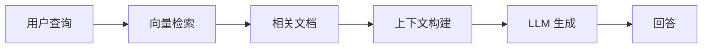

# 从零搭建 RAG 系统：完整指南

{/* truncate */}

检索增强生成（Retrieval-Augmented Generation，RAG）是目前最热门的 AI 应用架构之一。本文将带你从零搭建一个完整的 RAG 系统。

## 什么是 RAG？

RAG 是一种结合了信息检索和大语言模型的技术架构。它的核心思想是：

1. 从知识库中检索与用户查询相关的文档
2. 将检索到的文档作为上下文提供给 LLM
3. LLM 基于上下文生成更准确的回答



## 核心组件

### 1. 文档处理

首先需要将文档转换为可检索的格式：

```python
from langchain.text_splitter import RecursiveCharacterTextSplitter

text_splitter = RecursiveCharacterTextSplitter(
    chunk_size=500,
    chunk_overlap=50,
    separators=["\n\n", "\n", "。", ".", " "]
)

chunks = text_splitter.split_documents(documents)
```

### 2. 向量嵌入

将文本块转换为向量表示：

```python
from langchain.embeddings import OpenAIEmbeddings

embeddings = OpenAIEmbeddings()
vectors = embeddings.embed_documents([chunk.page_content for chunk in chunks])
```

### 3. 向量存储

使用 Chroma 作为向量数据库：

```python
from langchain.vectorstores import Chroma

vectorstore = Chroma.from_documents(
    documents=chunks,
    embedding=embeddings,
    persist_directory="./chroma_db"
)
```

### 4. 检索和生成

构建完整的 QA 链：

```python
from langchain.chains import RetrievalQA
from langchain.chat_models import ChatOpenAI

qa_chain = RetrievalQA.from_chain_type(
    llm=ChatOpenAI(model="gpt-4", temperature=0),
    chain_type="stuff",
    retriever=vectorstore.as_retriever(search_kwargs={"k": 3})
)

answer = qa_chain.run("你的问题")
```

## 优化策略

### Chunk Size 调优

- 太小的 chunk 会丢失上下文
- 太大的 chunk 会降低检索精度
- 推荐从 500 tokens 开始实验

### 检索策略

- **Top-K**：返回最相关的 K 个文档
- **相似度阈值**：过滤低相关性结果
- **MMR**：平衡相关性和多样性

### Prompt 优化

```text
使用以下上下文回答问题。如果无法从上下文中找到答案，请明确说明。

上下文：
{context}

问题：{question}

请给出详细的回答，并引用上下文中的具体信息。
```

## 下一步

- [高级 RAG 技术](/docs/skills/rag/advanced)
- [知识库构建](/docs/skills/knowledge-base)
- [Dify Chatflow 开发](/docs/skills/dify/chatflow)

欢迎在评论中分享你的 RAG 实践经验！
