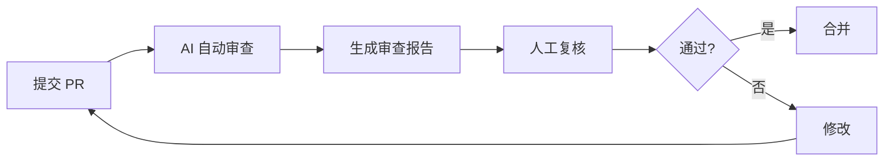

# 代码审查

使用 AI 工具进行自动化代码审查。

## 安装

在 Cursor 中配置 `.cursorrules`：

```yaml
review_rules:
  - check security vulnerabilities
  - verify error handling
  - validate type safety
  - ensure test coverage
```

## Prompt

```text
请审查以下 PR 代码，关注：
1. 安全问题
2. 性能影响
3. 边界条件
4. 代码风格
```

## Workflow



## 注意事项

- AI 审查作为辅助，关键逻辑仍需人工审查
- 配置项目特定的审查规则
- 定期更新审查规则库
