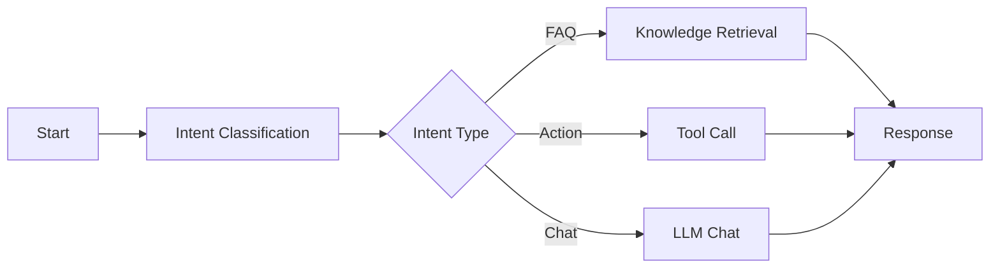

# Chatflow 开发

Dify Chatflow 应用开发的最佳实践和技巧。

## 安装

访问 [Dify Cloud](https://cloud.dify.ai) 或自行部署：

```bash
git clone https://github.com/langgenius/dify.git
cd dify/docker
docker-compose up -d
```

## Prompt

Chatflow 中 LLM 节点的 System Prompt 示例：

```text
你是一个智能客服助手。

<任务规则>
1. 优先从知识库中查找答案
2. 知识库无答案时使用通用知识
3. 无法回答时引导用户转人工
</任务规则>
```

## Workflow



## 注意事项

- 合理使用条件分支减少 Token 消耗
- 设置节点超时时间
- 添加错误处理逻辑
