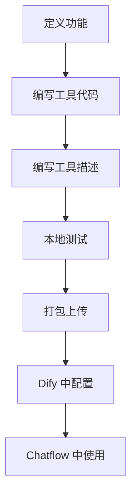

# 插件开发

Dify 自定义插件和工具的开发流程。

## 安装

```bash
# Dify 插件 CLI
npm install -g @dify/plugin-cli

# 创建插件项目
dify-plugin init my-custom-plugin
cd my-custom-plugin
npm install
```

## Prompt

插件工具的 Function Description：

```json
{
  "name": "search_products",
  "description": "Search product catalog by name or category",
  "parameters": {
    "query": {
      "type": "string",
      "description": "Search keyword"
    }
  }
}
```

## Workflow



## 示例

```python
# tools/search_products.py
def search_products(query: str) -> list:
    """Search products API."""
    response = requests.get(f"/api/products?q={query}")
    return response.json()
```

## 注意事项

- 工具描述直接影响 LLM 调用准确度
- 处理异常情况返回结构化错误信息
- 注意 API 调用的频率限制
