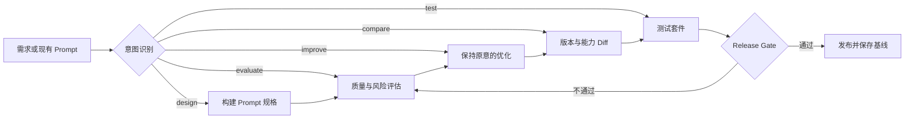

# PromptOps

**开放标准 Skill，用于工程化可靠的 Prompt。**

PromptOps 不是又一个 Prompt 生成器——它是一套面向 AI Agent 与 LLM 应用开发的 **Prompt 质量工作流**：用共同标准发现失败模式，用测试验证改动，用回归门禁保护可靠性。

## 为什么需要 PromptOps？

Prompt 进入生产环境后，问题通常不再是"写得不够漂亮"，而是：

| 常见失败模式 | 表现 |
|------------|------|
| **输出漂移** | 同一任务多次执行结果不一致 |
| **幻觉编造** | 缺少依据时自行编造信息 |
| **指令冲突** | 系统指令与用户输入优先级模糊 |
| **模型退化** | 换模型后行为异常、能力倒退 |
| **引用失真** | RAG 场景下来源标注错误 |
| **越权调用** | Agent 未经授权执行工具或操作 |
| **无回归验证** | 修改后没有测试，上线即翻车 |

传统做法关注"怎么写 Prompt"，PromptOps 关注 **"Prompt 能否可靠完成任务"**。

## 核心理念

将 Prompt 视为可测试的工程制品，优化目标是**任务成功率、稳定性、安全性、可追溯性和可维护性**——而非文字优美程度。

## 五大核心能力

### 1. 质量审计（Quality Audit）
对 Prompt 做证据化评分，识别幻觉、冲突、漂移、注入与不可测试风险。评估覆盖五个层面：
- **Specification** — 任务、输入、输出、验收标准是否清晰可观察
- **Grounding** — 依据、引用、不确定性和防编造机制
- **Control** — 指令优先级、权限、边界、失败和恢复行为
- **Fit** — 是否适配目标场景与模型能力
- **Verification** — 是否能通过典型、边界、对抗和回归测试

### 2. 安全优化（Safe Optimization）
保持任务意图、输出接口和语言风格不变，按风险优先级进行优化，每项改动附带变更记录和预期影响说明。

### 3. 版本比较（Version Comparison）
用同一基线比较多个版本，发现能力回退、兼容性破坏和新阻塞项。评分更高的版本若引入新阻塞风险，仍会被拦截。

### 4. 测试与发布门禁（Testing & Release Gate）
生成典型、边界、对抗和合规用例，定义断言与发布门禁。发布必须满足：所有阻塞断言通过、无回归失败、通过率达标。

### 5. 设计新 Prompt（Prompt Design）
从需求出发，产出最小但完整的 Prompt 规格：角色→目标→上下文→输入契约→约束→输出契约→验收标准。

## 与传统方法对比

| 常见做法 | PromptOps |
|---------|-----------|
| 关注"如何写 Prompt" | 关注"Prompt 能否可靠完成任务" |
| 一次生成即结束 | 评估 → 优化 → 对比 → 测试 → 发布 |
| 靠主观感觉判断好坏 | 评分锚点、失败模式与引用证据 |
| 只检查结构是否完整 | 同时检查稳定性、幻觉、冲突、场景与模型适配 |
| 改完直接上线 | 版本 diff、对抗测试、回归门禁 |

## 部署模式

PromptOps 是**纯 Markdown、无专有运行时依赖**的 Agent-native Skill：
- 可克隆仓库安装到 Claude Code、Codex、Trae、WorkBuddy 等任何支持 Skill 的 Agent
- 不安装也可直接复用方法论，从评分规范或测试方法开始接入现有工作流
- 相对路径引用，跨平台可移植

## 开始使用

按教程顺序阅读：

- **[快速开始](/docs/skills/engineering/prompt-ops/quickstart)** — 安装配置与基本用法
- **[质量审计](/docs/skills/engineering/prompt-ops/quality-audit)** — 评估体系与评分方法
- **[安全优化](/docs/skills/engineering/prompt-ops/optimization)** — 改进策略与变更管理
- **[版本比较](/docs/skills/engineering/prompt-ops/comparison)** — 多版本对比与回归检测
- **[测试与发布](/docs/skills/engineering/prompt-ops/testing)** — 测试用例生成与发布门禁
- **[设计新 Prompt](/docs/skills/engineering/prompt-ops/design)** — 从零构建 Prompt 规格

:::tip 开源仓库
PromptOps 是一个开源项目：[github.com/lbytsl/skills-promptops](https://github.com/lbytsl/skills-promptops)
:::
