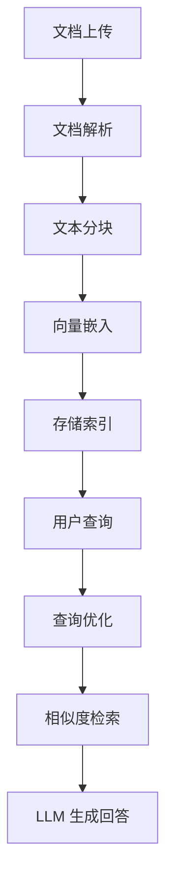

# RAG 集成

将知识库集成到 RAG 系统的完整方案。

## 安装

```bash
pip install chromadb langchain openai
```

## Prompt

```text
基于以下知识库内容回答问题。
如果无法从知识库中找到答案，请明确说明。
知识库内容: {context}
问题: {question}
```

## Workflow



## 示例

```python
from langchain.vectorstores import Chroma
from langchain.embeddings import OpenAIEmbeddings

# 加载向量数据库
vectorstore = Chroma(
    persist_directory="./kb_store",
    embedding_function=OpenAIEmbeddings()
)

# 检索
docs = vectorstore.similarity_search("How to deploy?", k=3)
```

## 注意事项

- Chunk size 建议 500-1000 tokens
- 使用 overlap 保持上下文连贯
- 定期更新向量索引
