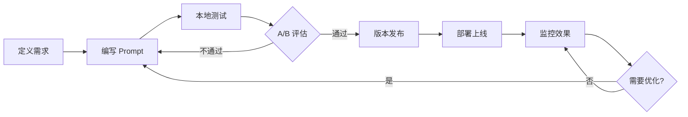

# 工作流

PromptOps 的标准工作流程，覆盖 Prompt 从开发到上线的完整生命周期。

## 流程图

## 各阶段说明

### 1. 定义需求
- 明确 Prompt 的目标和预期效果
- 定义评估指标（准确性、相关性、创造性等）

### 2. 编写 Prompt
- 遵循 Prompt 模板规范
- 包含角色、指令、格式要求

### 3. 本地测试
- 使用评测数据集批量测试
- 记录每个版本的测试结果

### 4. A/B 评估
- 对比不同版本效果
- 人工评审 + 自动化评分

### 5. 版本发布
- Git 标签管理版本
- 生成 CHANGELOG

### 6. 部署上线
- 通过 API 或 SDK 集成
- 灰度发布策略

### 7. 监控效果
- 收集使用数据
- 用户反馈分析
