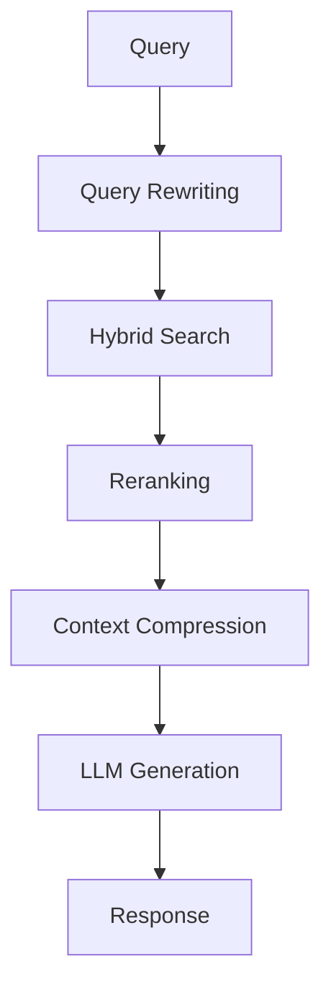

# 高级 RAG

RAG 系统的进阶技术和优化策略。

## 高级技术

### 1. 多路召回 (Hybrid Search)

结合向量检索和关键词检索，提高召回率。

```python
from langchain.retrievers import BM25Retriever, EnsembleRetriever

bm25_retriever = BM25Retriever.from_documents(docs)
vector_retriever = vectorstore.as_retriever()

ensemble = EnsembleRetriever(
    retrievers=[bm25_retriever, vector_retriever],
    weights=[0.4, 0.6]
)
```

### 2. 重排序 (Re-ranking)

对召回结果进行二次排序，提升相关性。

### 3. 查询重写 (Query Rewriting)

自动优化用户查询以获得更好的检索效果。

### 4. 上下文压缩

保留最相关的内容，减少 LLM 上下文开销。

## Workflow



## 注意事项

- 根据场景选择合适的检索策略
- 监控各环节延迟，优化性能瓶颈
- 建立评测体系持续优化
