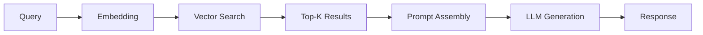

# 基础 RAG

最简 RAG 系统的实现指南。

## 安装

```bash
pip install langchain chromadb openai
```

## Prompt

```text
使用以下上下文回答问题:
{context}

问题: {question}

如果上下文不包含相关信息，请如实说明。
```

## Workflow



## 示例

```python
from langchain.chains import RetrievalQA
from langchain.vectorstores import Chroma
from langchain.llms import OpenAI

qa = RetrievalQA.from_chain_type(
    llm=OpenAI(),
    chain_type="stuff",
    retriever=vectorstore.as_retriever()
)
answer = qa.run("What is RAG?")
```

## 注意事项

- top_k 设为 3-5 通常效果最佳
- 使用 Stuff chain 适合短上下文
- 长上下文使用 MapReduce 或 Refine
